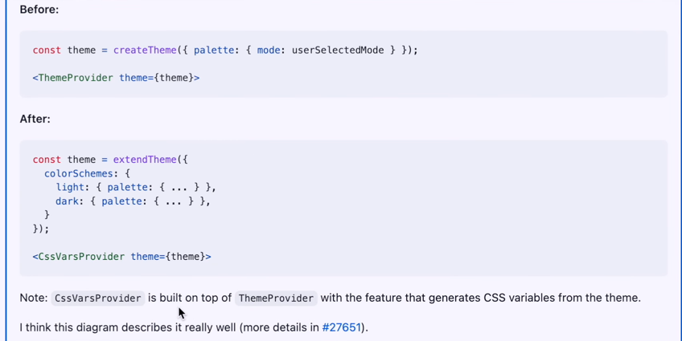
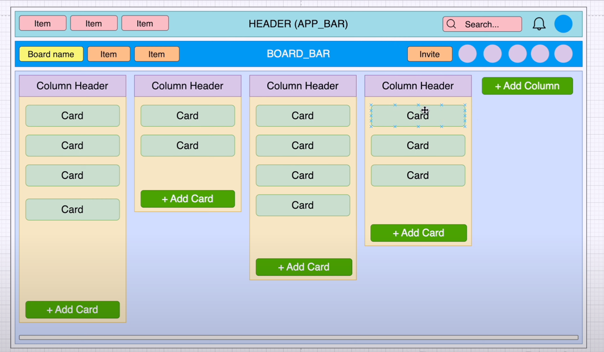

# React + Vite

This template provides a minimal setup to get React working in Vite with HMR and some ESLint rules.

Currently, two official plugins are available:

- [@vitejs/plugin-react](https://github.com/vitejs/vite-plugin-react/blob/main/packages/plugin-react/README.md) uses [Babel](https://babeljs.io/) for Fast Refresh
- [@vitejs/plugin-react-swc](https://github.com/vitejs/vite-plugin-react-swc) uses [SWC](https://swc.rs/) for Fast Refresh

# JSX
1. JSX là gì?
- cú pháp mở rộng kết hợp cả javascipt + html cùng 1 file.
- jsx và react là 2 thằng riêng biệt.
- jsx không cho phép nhiêu thẻ html, chúng cần được bọc vào thẻ div hoặc dùng cú pháp fragment <>...</>, nếu dùng như này khi render sẽ k có thẻ div bọc bên ngoài.
- thẻ img cần phải có đóng, 
- thẻ class sẽ dưới dạng camelcase: ví dụ: className=
- style thì sẽ là 1 object {} chứa các thuộc tính của css, khi đưa vào jsx sẽ bọc thêm 1 lớp {} của jsx nữa.
- jsx extenstion
- component Naming: PascalCase và camelCase cho các phiển bản của họ.
- Trong 1 project có thể chứa cả 2 file js và jsx
+ file js nên chỉ chứa source javascript thuần như axit....
+ file jsx là các file component chứa js và html, đại diện cho 1 component trong react.
- Nhưng nếu dùng file thì k recomment sử dụng tên file .js

# Sematic versioning.
x.y.z
    - x: major version, major changes, breaks the API.
    - y: minor version, minor changes, does not break the API
    - z: patches bug fixes
```
~version “Approximately equivalent to version”, will update you to all future patch versions, without incrementing the minor version. ~1.2.3 will use releases from 1.2.3 to <1.3.0.
- tăng patches

^version “Compatible with version”, will update you to all future minor/patch versions, without incrementing the major version. ^1.2.3 will use releases from 1.2.3 to <2.0.0.
- tăng minor.
```

# Thư viện ui
- bootstrap
- tailwind
- material ui

# Dark, light
- old version using ThemeProvider
- new version using CssVarsProvider



# Box and div
- support style better with box
- sx props of Box support for multiple size screen
- styled API.

# Customize css
1. One off customization
2. 

# Layout



# Config relative path
1. Add to vite.config.js
```resolve: {
    alias: [
      {find: '~', replacement: '/src'}
    ]
  }
```
2. Create file jsconfig.json
```
    {
      "compilerOptions": {
        "paths": {
          "~/*": ["./src/*"]
        }
      }
    }
```

# Config SvgIcon
    https://www.npmjs.com/package/vite-plugin-svgr

# Breakpoints
    xs, extra-small: 0px
    sm, small: 600px
    md, medium: 900px
    lg, large: 1200px
    xl, extra-large: 1536px
# Html, css
    g: The gap property defines the size of the gap between the rows and between the columns in flexbox, grid or multi-column layout. It is a shorthand for the following properties:
    row-gap
    column-gap
    Note: The gap property was formerly known as grid-gap.
    &: Ap dung cho component do
    *: Ap dung cho root

# Destructuring assignment
    https://developer.mozilla.org/en-US/docs/Web/JavaScript/Reference/Operators/Destructuring_assignment
